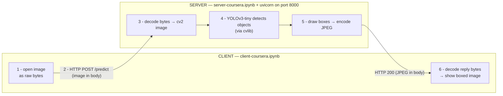
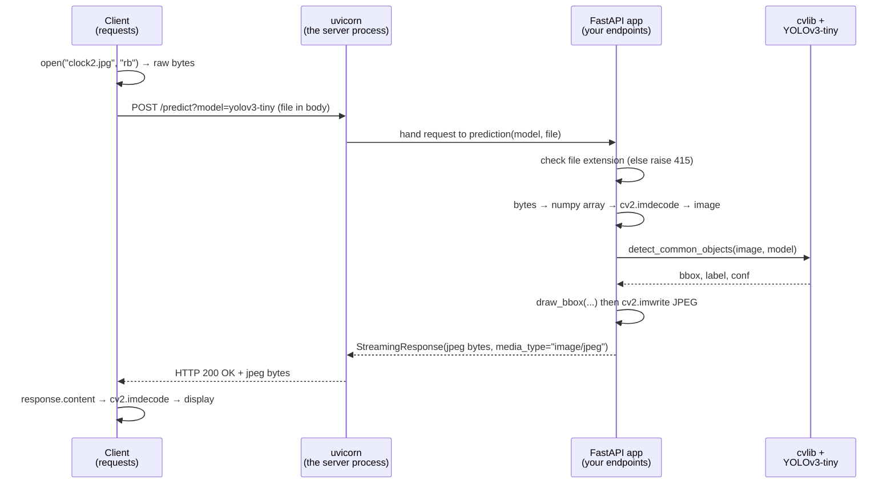

# How It Works — Server & Client Flow (Teaching Notes)

> A guided tour of what `server-coursera.ipynb` and `client-coursera.ipynb` actually
> build, and the concepts you should walk away understanding. Read this once before
> moving on to the Docker lab — it's the mental model everything else builds on.

---

## 1. The one-sentence summary

> You wrapped a pre-trained object-detection model (**YOLOv3-tiny**) inside a small
> **web API** (built with **FastAPI**, served by **uvicorn**) so that *any* client can
> send it an image over **HTTP** and get back the same image with boxes drawn around
> the objects it found.

That's the whole idea of "deployment": turning a model that only you can run in a
notebook into a **service** that others can call over the network.

---

## 2. The mental model: client ↔ server

Think of a **restaurant**:

| Restaurant | Our system |
|---|---|
| Customer | **Client** (`client-coursera.ipynb`, or the `/docs` web page, or a phone app) |
| Waiter + kitchen | **Server** (`server-coursera.ipynb` running under uvicorn) |
| The menu | The **API** — the fixed list of things you're allowed to ask for |
| Placing an order | An **HTTP request** |
| The dish arriving | An **HTTP response** |

The client never touches the model directly. It only knows the **menu** (the API):
"I can POST an image to `/predict` and I'll get a boxed image back." How the kitchen
cooks it (YOLO, OpenCV, TensorFlow) is hidden. **That hiding is the point** — it's what
lets a mobile app use your model without knowing any Python.



---

## 3. The round trip, step by step

This is the single most important diagram. Notice the **symmetry**: the image is
decoded from bytes on the way *in* (server) and again on the way *out* (client).
Over HTTP, an image is **always just a stream of bytes** — each side must decode it.



---

## 4. The SERVER, explained (`server-coursera.ipynb`)

### 4a. Two layers: FastAPI vs uvicorn

This trips up a lot of beginners, so make it crisp:

- **FastAPI** is the **framework** you *write*. It's where you declare "there's an
  endpoint at `/predict` and here's the function that handles it." FastAPI produces an
  *application object* (`app`) but that object doesn't listen on the network by itself.
- **uvicorn** is the **server** that *runs* that app. It's the process that actually
  binds to `127.0.0.1:8000`, speaks the HTTP protocol on the wire, and calls your
  FastAPI functions when requests come in.

> Analogy: **FastAPI writes the menu and the recipes; uvicorn is the building that opens
> its doors on port 8000 and employs the waiter.** You need both.

```python
app = FastAPI(title='Deploying an ML Model with FastAPI')  # the application
uvicorn.run(app, host="127.0.0.1", port=8000)              # the server that runs it
```

(`nest_asyncio.apply()` is only there because we run uvicorn *inside* a Jupyter kernel,
which already has an event loop running. In a normal `.py` file — like the Docker lab —
you won't need it.)

### 4b. Endpoints = URL + HTTP verb + a function

An **endpoint** is a specific address on your server. You create one by writing a
function and **decorating** it. The decorator says *which URL* and *which HTTP verb*
triggers the function.

```python
@app.get("/")                 # GET  http://127.0.0.1:8000/
def home():
    return "Congratulations! ..."

@app.post("/predict")         # POST http://127.0.0.1:8000/predict
def prediction(model: Model, file: UploadFile = File(...)):
    ...
```

- **GET** = "give me something," no body needed → used for the friendly home message.
- **POST** = "here's some data, do something with it" → used to *submit an image*.
  Predictions are almost always POST, because you have to hand the model input.

### 4c. How parameters arrive: query string vs request body

Look closely at the `/predict` signature — it takes **two very different kinds of input**:

| Parameter | How it travels | Why |
|---|---|---|
| `model: Model` | in the **URL query string**: `/predict?model=yolov3-tiny` | small, simple text value |
| `file: UploadFile = File(...)` | in the **request body** as multipart form-data | large binary blob — doesn't belong in a URL |

This is a real, general rule: **small scalar values ride in the URL; big binary payloads
(files, images) ride in the body.**

### 4d. Free validation from type hints + `Enum`

You wrote `model: Model` where `Model` is an `Enum` with exactly two allowed values.
Because of that single type hint, FastAPI will **automatically reject** any request whose
`model` isn't `yolov3` or `yolov3-tiny` — you didn't write a single `if` to check it.
This is FastAPI's superpower: **your type hints *are* your input validation.** (Under the
hood this is powered by a library called **Pydantic**.)

You *do* manually validate one thing — the file extension — and when it's wrong you raise:

```python
raise HTTPException(status_code=415, detail="Unsupported file provided.")
```

`415` is the HTTP status code for "Unsupported Media Type." Returning meaningful status
codes is how a server tells a client *what went wrong* in a machine-readable way.

### 4e. The 4 steps inside `/predict`

1. **Validate** the file extension (jpg/jpeg/png) → else `415`.
2. **Decode**: raw upload bytes → `io.BytesIO` → `numpy` array → `cv2.imdecode` → an image
   OpenCV can work with. (Remember this dance — the client does the *exact same thing* in
   reverse.)
3. **Predict**: `cv.detect_common_objects(image, model)` returns `bbox, label, conf`, then
   `draw_bbox(...)` paints the boxes onto the image.
4. **Respond**: save the boxed image, then send it back as a `StreamingResponse` with
   `media_type="image/jpeg"` so the client knows it's receiving a JPEG.

### 4f. The gift you get for free: `/docs`

Because you described your endpoints with types, FastAPI auto-generates an interactive
web page at **`http://127.0.0.1:8000/docs`** (Swagger UI). It reads a machine description
of your API called **OpenAPI** (`/openapi.json`). That page is itself a fully working
**client** — you can upload an image and see the boxed result without writing any client
code at all. This is why the notebook could test the model before the client notebook even
existed.

---

## 5. The CLIENT, explained (`client-coursera.ipynb`)

The client notebook exists to answer: *"What is that `/docs` page actually doing under the
hood?"* The answer: it makes plain HTTP requests — and you can too, with the **`requests`**
library.

### 5a. Building the URL

```python
base_url = 'http://localhost:8000'
endpoint = '/predict'
model    = 'yolov3-tiny'
full_url = base_url + endpoint + "?model=" + model
#        = 'http://localhost:8000/predict?model=yolov3-tiny'
```

See how `?model=yolov3-tiny` is the **query parameter** from §4c, assembled by hand. The
image is *not* in the URL — it goes in the body (next step).

### 5b. Sending the image

```python
files = {'file': image_file}          # key MUST be 'file' — it matches the server's parameter name
response = requests.post(url, files=files)
```

The dictionary key `'file'` is **not arbitrary** — it has to match the parameter name
`file` in the server's `prediction(model, file)`. This matching of names is part of the
**API contract**: client and server have to agree, or the request fails.

`requests.post(..., files=...)` is what packages the image as **multipart form-data** in
the body — the same thing the browser does when you pick a file in the `/docs` page.

### 5c. Reading the reply

```python
if response.status_code == 200:   # 200 = success
    ...
```

Then to *see* the boxed image, the client decodes the response bytes with the **same
byte→numpy→cv2 dance** the server used on the way in:

```python
image_stream = io.BytesIO(response.content)
file_bytes   = np.asarray(bytearray(image_stream.read()), dtype=np.uint8)
image        = cv2.imdecode(file_bytes, cv2.IMREAD_COLOR)   # ← identical idea to server step 2
```

> **The big lesson:** HTTP moves *bytes*. Whoever receives those bytes — server or client —
> is responsible for decoding them back into a usable object (here, an image). That
> symmetry is the single most transferable idea in this whole lab.

---

## 6. Tools & libraries glossary

| Tool | Layer | What it does here | Remember it as… |
|---|---|---|---|
| **FastAPI** | web framework | Lets you declare endpoints with decorators; validates inputs from type hints; auto-generates `/docs` | *"defines the menu & recipes"* |
| **uvicorn** | ASGI server | The process that listens on port 8000 and runs the FastAPI app | *"opens the doors, employs the waiter"* |
| **Pydantic** | validation (inside FastAPI) | Turns your type hints (`model: Model`) into automatic request validation | *"the bouncer checking orders"* |
| **HTTP** | protocol | The request/response language client & server speak (GET, POST, status codes) | *"how orders & dishes travel"* |
| **requests** | client library | Makes HTTP calls from Python in a few lines | *"a customer that can phone in orders"* |
| **cvlib** | ML convenience lib | `detect_common_objects()` + `draw_bbox()` wrap YOLO so you don't touch raw model code | *"the pre-made recipe kit"* |
| **YOLOv3-tiny** | the model | The actual neural net that finds objects; "tiny" = smaller/faster/less accurate | *"the chef's skill"* |
| **OpenCV (cv2)** | image I/O | Encodes/decodes images between bytes and arrays; draws rectangles & labels | *"prepping & plating"* |
| **NumPy** | arrays | The array format images live in while being processed | *"the cutting board"* |
| **TensorFlow** | ML backend | Pulled in as a hard dependency of cvlib (not doing the detection itself — cv2's DNN does) | *"a tool in the drawer we're forced to keep"* |

---

## 7. What you should be able to explain after this

Tick these off — if you can say each out loud, you've got it:

- [ ] The difference between **FastAPI** (the app you write) and **uvicorn** (the server that runs it).
- [ ] What an **endpoint** is, and why `/predict` is **POST** while `/` is **GET**.
- [ ] Why the **model name** goes in the URL but the **image** goes in the request body.
- [ ] How a single type hint (`model: Model`) gives you **automatic input validation** for free.
- [ ] What HTTP status **200** means, and why the server raises **415** for a bad file.
- [ ] Why the **same byte→numpy→cv2 decode** appears on both the server *and* the client.
- [ ] What the `/docs` page is, and why it counts as a **client** just like the requests notebook.
- [ ] The idea of an **API contract**: why `files = {'file': ...}` must match the server's `file` parameter.

---

## 8. Small experiments to cement it

1. **Break the contract on purpose.** In the client, change `files = {'file': image_file}`
   to `files = {'image': image_file}` and watch the request fail — proof the names must match.
2. **Send a non-image.** POST a `.txt` file and confirm you get the **415** you coded.
3. **Watch the server logs.** While the client runs, look at the server cell's output — every
   `POST /predict?model=yolov3-tiny 200 OK` line is one round trip you just traced in §3.
4. **Use the two clients side by side.** Detect the same image via `/docs` in the browser *and*
   via the client notebook. Same endpoint, two different clients, identical result — that's
   deployment working.

---

*Next lab (`deploying-a-ml-model-with-docker/`): we take this exact server, strip the
Jupyter-only bits, and package it into a Docker container so it runs anywhere — then push it
to the cloud. The API contract you just learned stays identical; only where it runs changes.*
